<p align="center">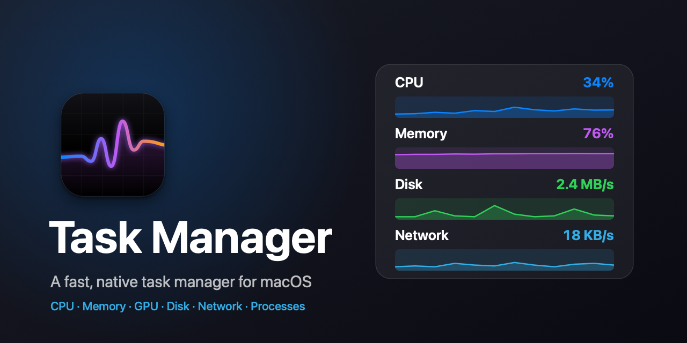</p>

# Task Manager – a native, Windows-style system monitor for macOS

[](https://github.com/Ol775/macos-task-manager/releases/latest)
[](https://github.com/Ol775/macos-task-manager/actions/workflows/ci.yml)
[](LICENSE)


**Task Manager** is a free, open-source Mac app that works like the Windows Task Manager: a sortable process list with **End Task**, live **CPU, memory, GPU, disk and network** graphs, and a system overview. It is written in Swift and SwiftUI with no third-party dependencies, runs natively on Apple silicon and Intel, and has Light, Dark and OLED Black themes. Current version: <!--v-->v0.4.2<!--/v-->.

## Features

- **Processes** – apps or all processes, sortable and searchable, with a confirmed **End Task**. Pick the columns you want: CPU, Memory, Disk, PID, User, Threads, State and Started.
- **Process details** – double-click a process for its path (with Reveal in Finder), parent, open files, code-signature status and open TCP/UDP ports.
- **Performance** – 60-second graphs for **CPU** (performance and efficiency cores), **Memory** (wired, compressed), **GPU**, **Disk** (read and write) and **Network** (send and receive, for all connections or one interface).
- **System** – model, chip, cores, memory, graphics, macOS version and build, up time, thermal state, storage and battery. The hostname and serial number are never read.
- **Menu bar mode** (optional) – a live readout in the menu bar (CPU, memory, GPU, disk and network, in any combination) with a popover of graphs and your busiest apps, and an option to hide the Dock icon. Turn it on in Settings → Menu bar.
- **Make it yours** – System / Light / Dark / **OLED Black** appearance, six accent colours plus a custom one, card corner style and per-graph colours. Settings are a page inside the window (⌘,).
- **Accessible** – VoiceOver labels throughout, full keyboard control of the process list, a Text size setting, Reduce Motion and Increase Contrast support. See [ACCESSIBILITY.md](ACCESSIBILITY.md).
- **Signed updates** – checks GitHub releases and installs only Ed25519-signed builds. See [SECURITY.md](SECURITY.md).
- **Private** – no telemetry, accounts or analytics. See [PRIVACY.md](PRIVACY.md).

## Screenshots

<table>
<tr>
<td width="50%">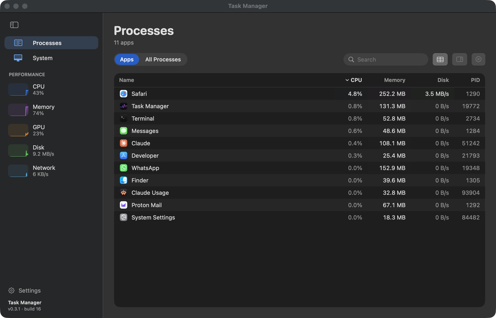</td>
<td width="50%">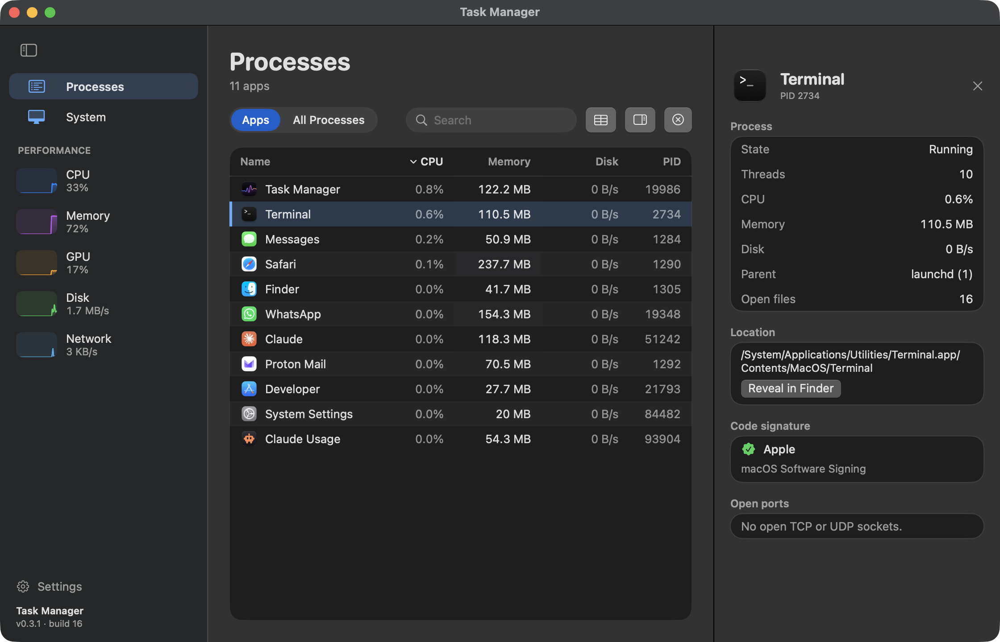</td>
</tr>
<tr>
<td width="50%">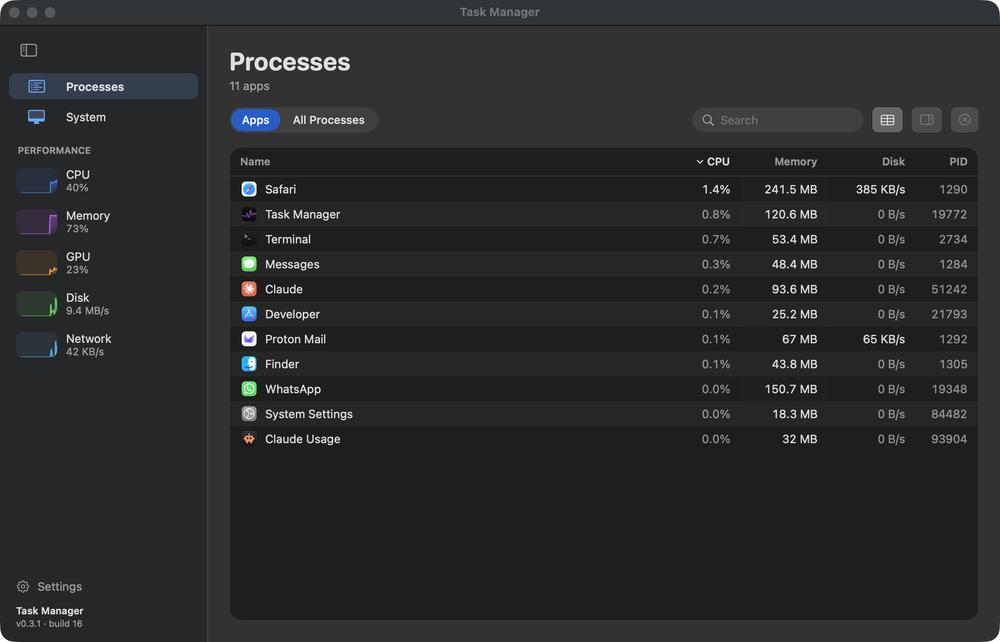</td>
<td width="50%">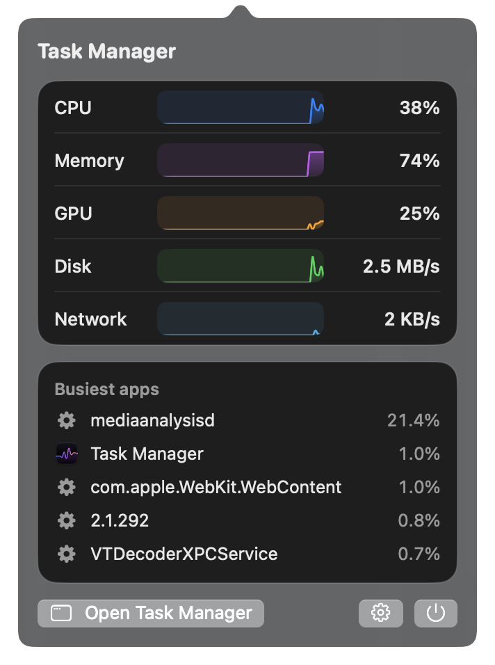</td>
</tr>
<tr>
<td width="50%">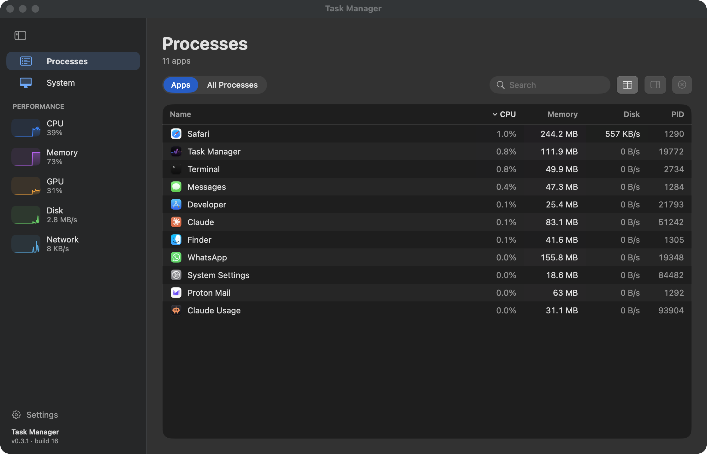</td>
<td width="50%">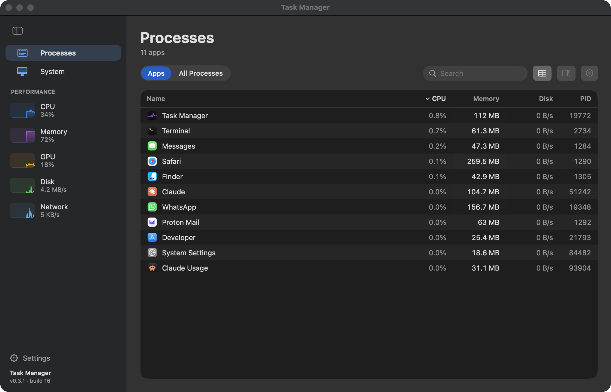</td>
</tr>
<tr>
<td width="50%">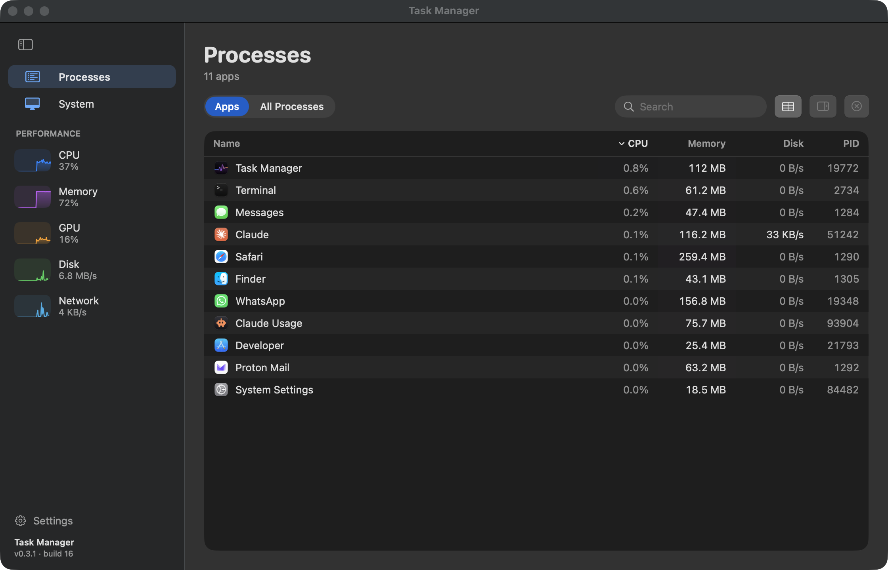</td>
<td width="50%">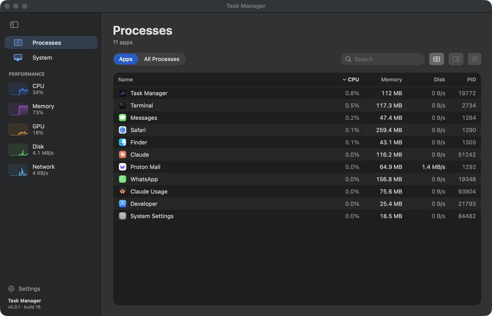</td>
</tr>
<tr>
<td width="50%">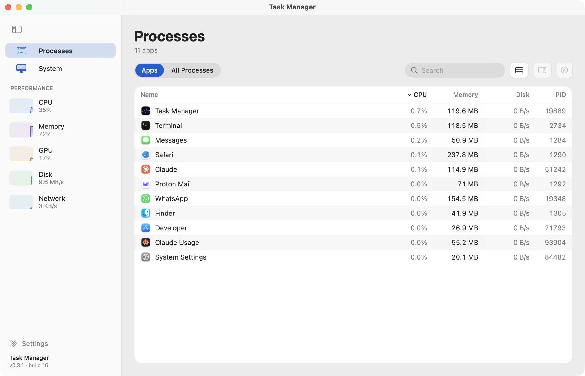</td>
<td width="50%">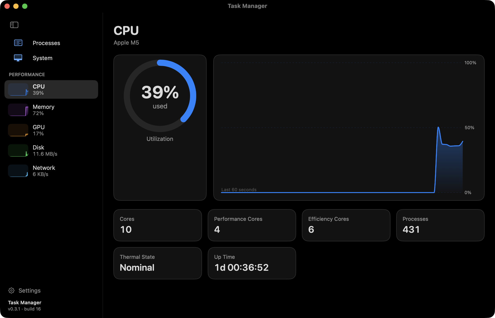</td>
</tr>
</table>

## Install

Requires macOS 15 or later. Builds are universal (Apple silicon and Intel).

**Homebrew** – installs the same DMG and clears the macOS first-launch block for you:

```sh
brew install --cask Ol775/tap/task-manager
```

**Download** – get `Task-Manager-<version>.dmg` from [Releases](../../releases), open it and drag **TaskManager** to Applications. Every release also has a `.sha256` file (`shasum -a 256 Task-Manager-<version>.dmg`).

The app is ad-hoc signed, not notarized (that needs a paid Apple Developer ID), so macOS blocks the first launch of a downloaded DMG. Either:

- open **System Settings → Privacy & Security**, scroll to the message about *TaskManager* and click **Open Anyway** (on macOS 15 and later the old right-click → Open shortcut no longer works), or
- run `xattr -dr com.apple.quarantine /Applications/TaskManager.app` once in Terminal.

After that, in-app updates install without any prompt, because the app downloads and verifies them itself.

**Build from source** – needs Xcode 16 or later (the Swift 6 toolchain):

```sh
git clone https://github.com/Ol775/macos-task-manager.git
cd macos-task-manager
./build-app.sh && open TaskManager.app
TaskManager.app/Contents/MacOS/TaskManager --selftest   # updater, sampling and contrast checks
```

## FAQ

**Why can't I see every process?** macOS only lets an unprivileged app inspect processes owned by the same user, so system and other users' processes aren't listed. Settings → Permissions shows how many are hidden. Showing them would need a privileged helper, which is on the [roadmap](ROADMAP.md) only if there is demand.

**Does it need special permissions?** No. There is no Full Disk Access, Accessibility or Screen Recording prompt.

**Is End Task safe?** It asks first, sends `SIGTERM` (a polite quit request) and only to the exact process that was listed: the start time is re-checked so a reused PID is never signalled.

**Why isn't it on the App Store?** The App Store requires the sandbox, which blocks the process APIs the app relies on.

**Why is there no per-process network column?** macOS doesn't expose it without elevated privileges. Network is shown per interface instead.

## Project

- [CHANGELOG.md](CHANGELOG.md) – what changed in each version
- [ROADMAP.md](ROADMAP.md) – what's next
- [CONTRIBUTING.md](CONTRIBUTING.md) – building, tests and pull requests
- [SECURITY.md](SECURITY.md), [PRIVACY.md](PRIVACY.md) and [ACCESSIBILITY.md](ACCESSIBILITY.md)

Releases are cut with `./bump.sh` and `./release.sh`, which build the universal DMG, sign it with an offline key and update the Homebrew cask. `tools/makeicon.swift` regenerates the icon and `docs/make-banner.swift` the banner.

## Licence

[MIT](LICENSE) © 2026 Ol775
