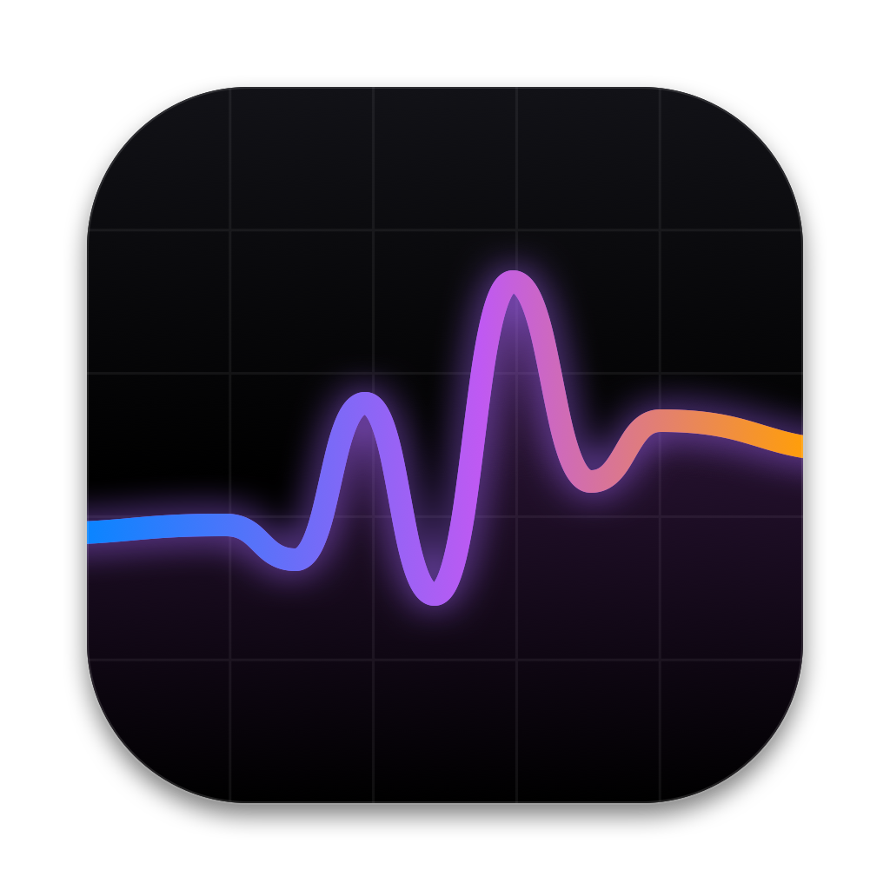
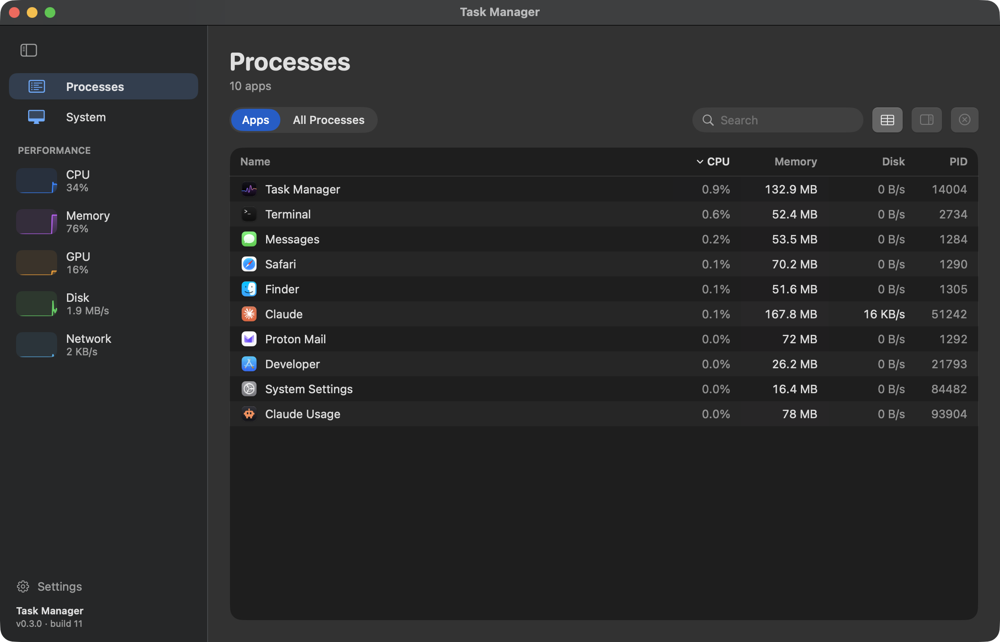
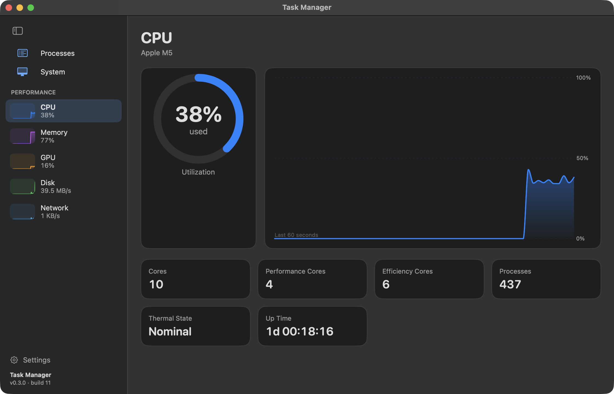
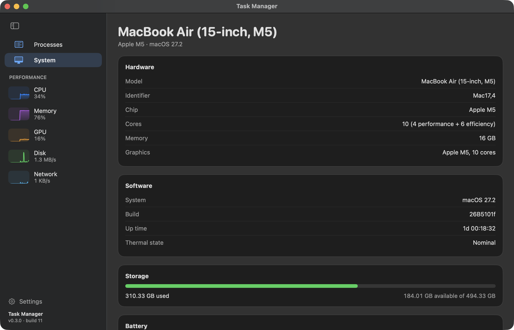
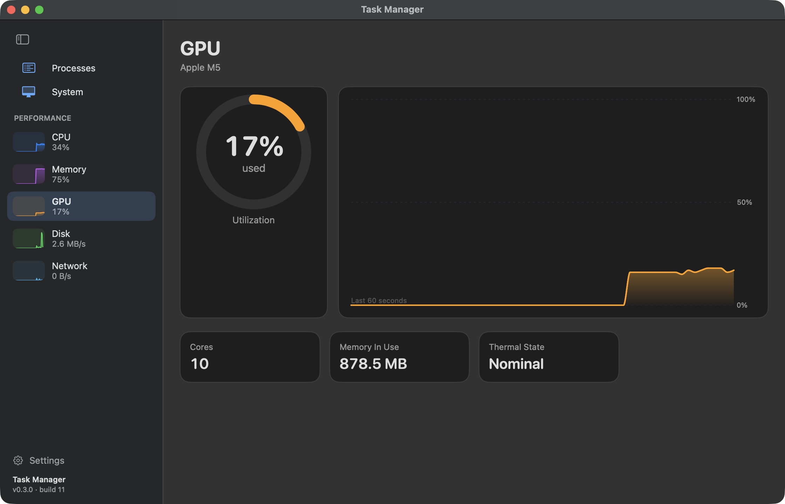
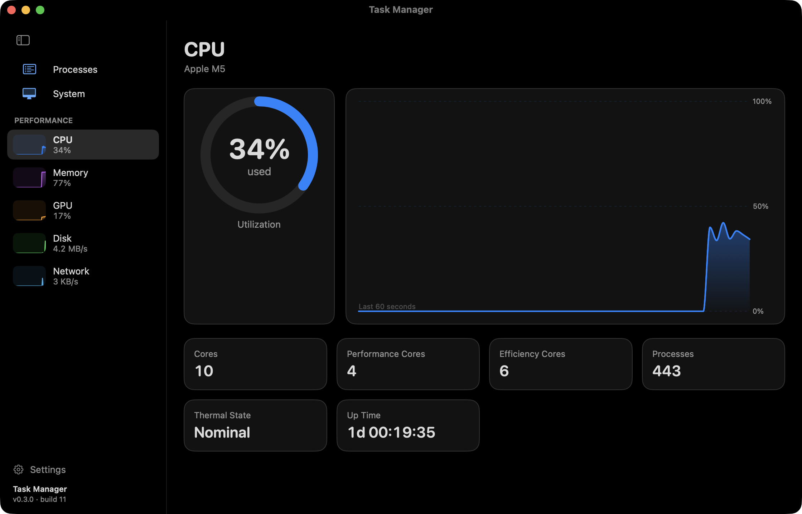

<div align="center">



# Task Manager

**A fast, native task manager for macOS.** Live CPU, memory and GPU graphs, a sortable process list with End Task, system information, and an OLED Black theme.




</div>

## Features

| | |
|---|---|
| **Processes** | Apps and all processes with CPU, memory and PID, sortable by any column, searchable, with a confirmed **End Task** (also on right-click). |
| **Performance** | Live 60-second graphs for **CPU**, **Memory** and **GPU**, with performance/efficiency cores, wired and compressed memory, GPU memory and thermal state. |
| **System** | Model, chip, core layout, memory, graphics, macOS version and build, up time, thermal state, storage and battery. |
| **Personalise** | System / Light / Dark / **OLED Black** appearance, per-graph colours, update speed from 0.5 s to 5 s. |
| **Permissions check** | Settings → Permissions shows exactly what the app can see and why some system processes are hidden. |
| **Signed updates** | Checks GitHub releases and installs only Ed25519-signed builds. See [SECURITY.md](SECURITY.md). |

<p align="center">
  
  
</p>
<p align="center">
  
  
</p>

## Install

Download `Task-Manager-<version>.dmg` from [Releases](../../releases), open it and drag **TaskManager** to Applications. Builds are universal (Apple silicon and Intel) and need macOS 15 or later.

The app is ad-hoc signed, not notarized (that needs a paid Apple Developer ID), so macOS blocks the first launch of a downloaded copy. Either:

- open **System Settings → Privacy & Security**, scroll to the message about *TaskManager* and click **Open Anyway** (on macOS 15 and later the old right-click → Open shortcut no longer works), or
- run `xattr -dr com.apple.quarantine /Applications/TaskManager.app` once in Terminal.

After that, in-app updates install without any prompt, because the app downloads and verifies them itself.

## Build from source

Requires Xcode 16+ (the Swift 6 toolchain):

```sh
git clone https://github.com/Ol775/macos-task-manager.git
cd macos-task-manager
./build-app.sh && open TaskManager.app
TaskManager.app/Contents/MacOS/TaskManager --selftest   # updater/signature checks
```

## Privacy

No telemetry, accounts or analytics. The only network request is the update check against this repository's GitHub releases (Settings → General turns it off). Hostname and serial number are never read.

## Limits

macOS only lets an unprivileged app inspect processes owned by the same user, so system and other users' processes aren't listed. Settings → Permissions shows the count.

## Releasing

`./bump.sh minor "note"` updates `VERSION` and the changelog. After building and pushing, `./release.sh "note"` builds the universal DMG, signs it with the offline release key and publishes the GitHub release. `tools/makeicon.swift` regenerates the icon.

## License

[MIT](LICENSE) © 2026 Ol775
